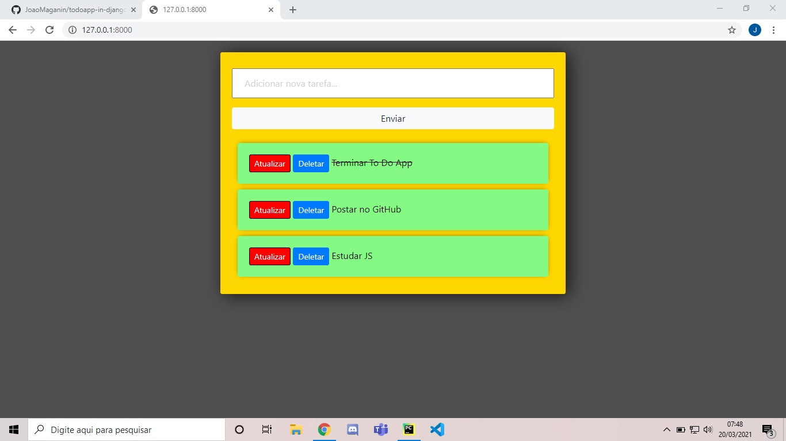

<h1 align=center>To Do App in Django</h1

<p align=center>Este projeto é uma lista de tarefas que foi contruida com Django e SQLite. Tem as simples funções de criar, atualizar, deletar e dizer se uma tarefa está completa
ou não. Tudo isso é puxado do banco de dados para ser mostrado na página do site.</p>
<p align=center>Este projeto é do youtuber Dennis Ivy, link do vídeo original: https://www.youtube.com/watch?v=4RWFvXDUmjo&t=2168s</p>



<h4>Como rodar a aplicação</h4

```
Execute o "pip install -r requirements.txt"
```

<h4>Após isso, executar</h4

```
python manage.py runserver
```
Projeto To Do List em Django
Este projeto é uma aplicação de lista de tarefas (To Do List) desenvolvida em Django. Ele permite que os usuários criem, editem e excluam tarefas, além de marcar as tarefas como concluídas ou não concluídas.

Funcionalidades
Criar uma nova tarefa: Os usuários podem adicionar novas tarefas com um título e uma descrição opcional.
Editar tarefas existentes: Os usuários podem editar o título e a descrição de uma tarefa já existente.
Excluir tarefas: Os usuários têm a opção de excluir tarefas que não são mais relevantes ou concluídas.
Marcar tarefas como concluídas: Os usuários podem marcar as tarefas como concluídas quando terminarem de realizá-las.
Filtrar tarefas: Os usuários podem filtrar as tarefas com base no status (concluídas ou não concluídas) para uma visualização mais fácil.
Ordenar tarefas: As tarefas são exibidas em ordem de criação, com as mais recentes exibidas primeiro.
Tecnologias Utilizadas
Django: Um framework web em Python para o desenvolvimento rápido de aplicações seguras e escaláveis.
HTML e CSS: Para a estruturação e estilização da interface do usuário.
Banco de dados SQLite: Utilizado para armazenar as tarefas e seus respectivos status.
Como executar o projeto
Certifique-se de ter o Python instalado em sua máquina.
Clone este repositório em sua máquina local.
Abra o terminal e navegue até o diretório do projeto.
Crie um ambiente virtual:
shell
Copy code
python -m venv myenv
Ative o ambiente virtual:
No Windows:
shell
Copy code
myenv\Scripts\activate
No macOS e Linux:
shell
Copy code
source myenv/bin/activate
Instale as dependências:
shell
Copy code
pip install -r requirements.txt
Execute as migrações do Django:
shell
Copy code
python manage.py migrate
Inicie o servidor de desenvolvimento:
shell
Copy code
python manage.py runserver
Abra seu navegador e acesse http://localhost:8000 para visualizar o projeto.
Contribuição
Contribuições são bem-vindas! Se você deseja contribuir para este projeto, sinta-se à vontade para abrir uma "issue" descrevendo a melhoria ou correção proposta. Além disso, você pode abrir um "pull request" com suas alterações para revisão
